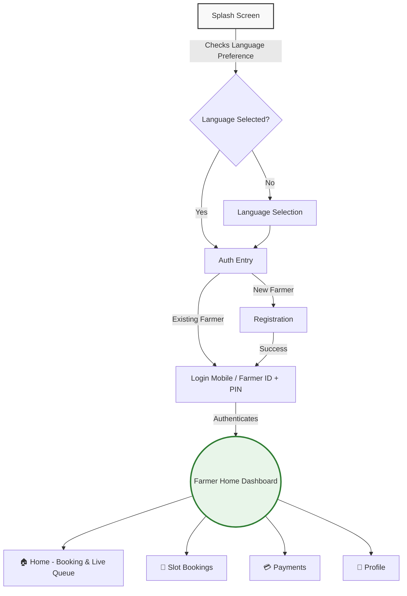

# 🌾 Kissaan Sync (Kisan-Sethu)

A modern, digital public-service Android application designed to provide farmers with a calm, trustworthy, and minimal interface for procurement slot bookings, live queue tracking, and direct payment tracking. 

Built with **Kotlin**, **Jetpack Compose**, and **Firebase**.

---

## 🏗️ Application User Flow

---

## ✨ Current Features (Phase 1 & 2.1)

* **Modern Digital Identity:** Ditch the agricultural clichés for a clean, government-service-oriented minimal UI.
* **Multi-Language Support:** Remembers localized language preferences securely.
* **Robust Registration:** 4-step secure onboarding storing Farmer details safely via Firebase Realtime Database.
* **Smart Authentication:** Log in seamlessly via a unique 6-character Farmer ID or 10-digit mobile number + secure 6-digit PIN.
* **Pill-Style Bottom Navigation:** Smooth, animated M3 bottom navigation cleanly routing across Dashboard, Bookings, Payments, and Profile.
* **Dynamic Dashboard:** Conditional UI displaying live queues and active token status only when a procurement slot is booked.
* **Material 3 Components:** Built using the latest Material Design 3 guidelines (including full-screen interactive loading indicators).

## 📥 Download

You can download the latest compiled APK directly from the **[release folder](release/KisanSethu-debug.apk)** in this repository.

## 🛠️ Tech Stack

* **UI Toolkit:** Jetpack Compose (Material 3)
* **Language:** Kotlin
* **Backend:** Firebase Realtime Database
* **Architecture:** MVVM, Navigation Component
